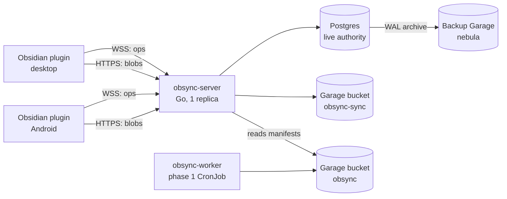
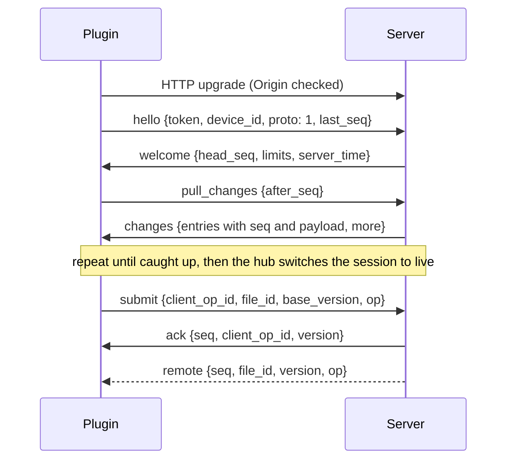

# obsync-single: Architecture Specification

2026-09-20 · @Someone

obsync-single keeps one person's Obsidian vault identical across their devices through a single Go authority that orders every edit, with Postgres as the live source of truth and Garage as durable snapshot and blob storage.

## 1. Scope, goals and invariants

Phase 2 is a single-user, multi-device sync system. One human edits; several of their devices read and write; one server orders everything. It is not multi-user collaboration (phase 3).

### In scope

| Capability | Detail |
| --- | --- |
| Text files (Class A) | `.md`, `.txt`, `.mdx`, configurable code extensions. Character-level sync via server-ordered operational transform (OT). |
| Freedraw PDF annotations (Class B) | `.annot.json` sidecars. Element-level sync keyed by annotation id. The source PDF is never modified. |
| Opaque files (Class C) | PDFs, images, attachments, anything else inside policy. Whole-blob, content-addressed, conflict copy on divergence. |
| Namespace operations | Create, rename, move, delete, folder operations, with file identity independent of path. |
| Offline editing | Edits made offline reconcile on reconnect, automatically inside a bounded window, by conflict copy outside it. |
| Canvas content | Phase 1 output appears read-only under a `Canvas/` subtree. The plugin surfaces Canvas-side changes, deletions and re-uploads. |
| Exclusion policy | Phase 1 rule engine reused: per-device include/exclude by path, type and size. |
| History | Per-file version history for 30 days, restorable by an admin CLI. |

### Out of scope

Multi-user editing of one document, peer-to-peer sync, end-to-end encryption, pptx/xlsx editing, Excalidraw, direct PDF binary editing, third-party app integrations, public internet exposure.

### Non-negotiable invariants

Every component, test and review is judged against these. A change that weakens one needs an ADR.

1. **No acknowledged edit is lost.** An `ack` is sent only after the edit is durably committed in Postgres.
2. **No acknowledged content is destroyed implicitly.** Content disappears only through an explicit delete from a device that had already seen that content. Everything else produces a conflict copy.
3. **Convergence.** Once all devices are online and idle, every device holds byte-identical content for every synced file, equal to the server head.
4. **Exactly-once application.** A retried submission is applied at most once. Retries are always safe.
5. **The server is the only orderer.** Client clocks never decide order. Server-assigned versions and sequence numbers do.
6. **Bounded everything.** Every queue, buffer, frame, file, batch and connection count has a configured ceiling. Hitting one degrades a single client, never the server.
7. **A new or empty device never deletes anything.** First sync of a device is pull-only until it has reconciled with the server.

## 2. System context and components

Five deployable parts, one authority. Devices never talk to each other or to Garage; every read and write goes through the sync server.



Ops travel on the WebSocket; bulk bytes travel on plain HTTPS. The Canvas bridge inside the server reads phase 1 manifests and publishes them as ordinary files.

### Responsibilities

| Component | Owns | Never does |
| --- | --- | --- |
| **Obsidian plugin** (TypeScript) | Local vault I/O through the Vault and Editor APIs, per-file sync state machine, shadow copies, offline queue, exclusion rules, UI (status, conflicts, Canvas notices, settings, bulk-delete confirmation) | Hold storage credentials, decide ordering, talk to Garage |
| **obsync-server** (Go) | Authentication, sessions, validation, OT transform and apply, version and sequence assignment, persistence, broadcast, compaction, blob service, Canvas bridge, metrics | Trust client clocks, block on a slow client, accept unbounded input |
| **Postgres** | File registry, per-file head version and content, op log, vault change feed, devices, blob registry, idempotency records | Store large binaries |
| **Garage, bucket `obsync-sync`** | Write-once snapshots of Class A/B content, content-addressed Class C blobs | Hold any mutable key |
| **obsync-worker** (phase 1, unchanged) | Mirroring Canvas into bucket `obsync` | Know phase 2 exists |

### Where phase 1 fits

Phase 1 keeps running untouched. The phase 2 server contains a **Canvas bridge** that polls `manifests/<course>/latest`, diffs it against what it last imported, and emits Class C file operations under `Canvas/<course name>/` as the system device `canvas`. Three rules follow:

- Class C files under `Canvas/` are bridge-owned. Device writes to them are rejected with `read_only_path`.
- Class A and B files under `Canvas/` are user-owned. That is what lets you annotate a lecture PDF with Freedraw and sync the sidecar.
- A Canvas deletion tombstones the PDF but never its sidecar or your notes. The plugin flags the orphan instead.

The phase 1 plugin is retired on devices that run phase 2. Both reading the same folder would fight.

## 3. Data model

A file is an identity, not a path. Every file has a `file_id` (UUIDv7) minted by the device that creates it, so a device can create files offline and a rename is just a change to one attribute.

### File classes

The class is fixed at creation and stored. A rename that would change class (for example `.md` to `.pdf`) is executed by the client as delete plus create.

| Class | Matches | Unit of change | Concurrency rule | Size ceiling (default) |
| --- | --- | --- | --- | --- |
| A: text | Configured text extensions, content is valid UTF-8, no NUL bytes | Text operation (retain / insert / delete) | OT, server order breaks ties | 8 MiB, else demoted to C |
| B: sidecar | `*.annot.json` that parses as the pinned Freedraw schema | Element put / delete by annotation id | Last writer wins per element, delete wins over a later put | 16 MiB, else demoted to C |
| C: opaque | Everything else inside policy | Whole blob, addressed by SHA-256 | Base-version check, conflict copy on divergence | 512 MiB |

Text positions are **UTF-16 code units**, because CodeMirror 6 and JavaScript strings use them. The Go side must count the same way and must reject an operation that splits a surrogate pair. Line endings and a BOM are content: nothing normalizes them.

### Postgres: live authority

Head content of Class A and B files lives in Postgres, not Garage. A text vault is small (tens of MB) and TOAST compresses it, so live sync keeps working when Garage is down. Garage holds history and binaries.

```sql
devices (id uuid pk, name text, token_hash bytea unique, created_at, revoked_at, last_seen_at)

vault (id smallint pk check (id = 1), head_seq bigint not null)   -- single row, see below

files (
  id uuid pk, path text not null, path_key text not null,  -- path_key = casefold(NFC(path))
  class char(1) check (class in ('A','B','C')),
  version bigint not null,            -- per-file, +1 per accepted change
  content_text text,                  -- Class A head
  content_json jsonb,                 -- Class B head
  blob_sha256 bytea,                  -- Class C head
  size bigint, deleted_at timestamptz, deleted_by uuid, created_by uuid,
  owner text check (owner in ('user','canvas'))
)
unique (path_key) where deleted_at is null

ops (file_id uuid, version bigint, device_id uuid, payload jsonb, bytes int,
     created_at timestamptz, primary key (file_id, version))

changes (seq bigint pk, file_id uuid, kind text, version bigint, device_id uuid, at timestamptz)

submissions (device_id uuid, client_op_id uuid, file_id uuid, result jsonb,
             primary key (device_id, client_op_id))   -- idempotency record

snapshots (file_id uuid, version bigint, object_key text, sha256 bytea, primary key (file_id, version))
blobs (sha256 bytea pk, size bigint, committed_at timestamptz)
```

Two details carry most of the correctness:

- **`path_key` uniqueness.** Windows and macOS file systems are case-insensitive. Two live files whose paths differ only in case would clobber each other on those devices, so the database refuses them.
- **The `vault.head_seq` row lock.** Every committing transaction does `UPDATE vault SET head_seq = head_seq + 1 RETURNING head_seq` and writes that value into `changes.seq`. The row lock serializes commits, so sequence order equals commit order. A plain `bigserial` does not give you that: two transactions can commit out of order, and a reader that sees seq 11 before seq 10 commits would skip 10 forever. At single-user write rates this serialization costs nothing.

### Garage: bucket `obsync-sync`

```
blobs/sha256/ab/cd/<hash>            Class C content, write-once
snapshots/<file_id>/<version>        Class A/B materialized content, write-once
```

No key is ever overwritten. That keeps the phase 1 property that a crash mid-write leaves only unreferenced garbage, which GC removes.

### Client state (per device)

For each synced file: `file_id`, path, class, `base_version`, the shadow (server content at `base_version`), in-flight submission, pending local changes. Plus the vault cursor `last_seq`. Shadows are persisted (IndexedDB), because after a crash the plugin rebuilds pending edits by diffing the file on disk against its shadow.

## 4. Sync model

The model is central-authority operational transform in the Jupiter tradition: clients edit optimistically, the server transforms each submission against history it has not seen and assigns the next version. No CRDT is needed because one server totally orders every change.

### 4.1 Class A: text operations

A text operation uses the ot.js encoding: a JSON array where a positive integer retains, a string inserts, and a negative integer deletes. `[5, "hi", -3, 10]` keeps 5, inserts "hi", deletes 3, keeps 10.

An operation is valid against a document only if retains plus deletes equal the document length exactly. This one check catches almost every buggy or hostile submission. Operations must also be canonical: no zero-length components, no two adjacent components of the same kind, insert before delete at the same position. Non-canonical input is rejected, not repaired.

**Server algorithm.** A submission carries `base_version = b`. The server head is `h >= b`.

1. Load ops `b+1 .. h` for the file (hot cache, else Postgres).
2. `op' = transform(op, historical)` for each historical op in order. The incoming op wins insert ties.
3. Validate `op'` against head content, apply it, set version `h+1`.
4. Commit op, head, change row and idempotency record in one transaction.
5. After commit, the hub reads the new change from the feed and sends `ack` to the submitter and `remote` to every other session, in vault sequence order (section 5.3).

**Client algorithm.** Each file runs the three-state machine from ot.js: `Synchronized`, `AwaitingAck(inflight)`, `AwaitingAckWithBuffer(inflight, buffer)`. At most one submission per file is in flight. Local edits compose into the buffer. An incoming remote op is transformed against inflight and buffer before it touches the editor. On `ack`, the buffer is sent.

**Where client ops come from.** Edits in an open editor are read from CodeMirror 6 transactions and converted to text operations exactly. Edits that happen outside the editor (another plugin, an external editor, a file restored from backup) are found by diffing the file against its shadow (differential synchronization) and converted to an operation.

**Flush policy.** The buffer is sent after 250 ms of editor idle, or every 1 s during continuous typing, whichever comes first. This keeps propagation well under the 5 s budget without a frame per keystroke.

### 4.2 Class B: sidecar element operations

A sidecar is parsed into a map `annotation id -> element`, plus the remaining top-level fields. The client computes element operations by parsing the old and new file and diffing by id:

```json
{"elements": [{"put": "a1", "value": {"...": "..."}}, {"del": "a7"}], "meta": {"put": {"pages": ["..."]}}}
```

Rules: a put replaces the whole element (a stroke is atomic). The later put in server order wins. A delete leaves a tombstone, and a put to a tombstoned id is dropped, so an erased stroke never reappears. Unknown fields are preserved in meaning, so a Freedraw upgrade does not corrupt files. Devices write the server's deterministic serialization, and convergence for Class B is checked on that canonical form, because Freedraw may reformat whitespace on save. Materialization orders elements by first-created version, then id, which keeps output deterministic.

**Freedraw constraint (verified against release 0.13.3).** Freedraw loads a sidecar once when a PDF is opened and keeps it in memory; it does not reload external changes during an annotation session. If the file changes on disk under it, its next save detects the conflict, refuses the normal write, and tries to write a separate recovery copy. So the client follows two rules:

1. **Defer remote writes.** While a PDF is open in any leaf on this device, remote Class B changes to its sidecar are applied to the shadow and queued, not written to disk. They are written when the PDF closes, and the status bar says remote annotations are waiting.
2. **Diff against the shadow the file was based on.** When Freedraw saves during a deferred period, the plugin diffs the saved file against the on-disk base, not the newer server state. The result contains only the local strokes, so the server merges them by element id and the remote strokes survive.

If a Freedraw recovery copy appears anyway (for example, a write slipped through), it syncs as an ordinary file and is listed in the conflicts view. It is never merged automatically.

### 4.3 Class C: blobs

The client uploads bytes with `PUT /v1/blobs/{sha256}`, then submits `put_blob {file_id, base_version, sha256, size}` on the WebSocket. The server refuses a reference to a blob that is not fully committed. If `base_version` is behind the head, the server keeps the head and creates a conflict copy holding the submitted blob.

### 4.4 Namespace operations

| Operation | Accepted when | Otherwise |
| --- | --- | --- |
| `create {file_id, path, class, content or sha256}` | `file_id` unused and `path_key` free | `path_taken`: client renames locally to `Name (2).md` and retries |
| `rename {file_id, new_path}` | File live, target free | `path_taken` as above; `file_deleted` if gone |
| `delete {file_id, base_version}` | `base_version == head` | `stale_delete`: someone edited since this device looked. The file stays and syncs back. |
| edit to a deleted file | never | `file_deleted`: client keeps its text as a conflict copy |

A rename of a PDF moves its sidecar in the same submission (`rename_group`), or Freedraw loses the pairing. The server applies a group atomically or not at all.

**Bulk-delete guard.** More than 25 deletes, or more than 10% of live files, from one device within 5 minutes is rejected with `bulk_delete_guard` unless the submission carries `confirmed: true`. The plugin only sets that after an explicit user confirmation dialog. This is the defense against a misconfigured vault path wiping everything.

### 4.5 Offline reconnect

On reconnect the client asks for changes since `last_seq`. For each file with local pending edits:

| Situation | Action |
| --- | --- |
| Server head equals client base | Send pending edits normally |
| Head ahead, gap within the **transform window** | Server transforms; normal path |
| Head ahead, gap outside the window | Server answers `rebase_required`. Client saves its local text as a conflict copy, then adopts the server head. |

The transform window is **24 hours or 5,000 ops since the client's base, whichever is smaller**. Past that, mechanically correct merges produce interleaved half-sentences nobody wants, so a conflict copy is the honest result. Conflict copies are named `Name (conflict 2026-09-20 1432 laptop).md`, in the spirit of Syncthing's `sync-conflict` files.

### 4.6 Version history

Ops are retained 30 days and snapshots compact them (section 6). Any version inside retention can be reconstructed as nearest snapshot plus ops. This is independent of the 24-hour transform window: history is for restoring, the window is for merging.

## 5. Protocol

Small control and edit messages go over one WebSocket per device; blob bytes go over ordinary HTTPS requests. Mixing a 50 MB upload into the op stream would stall every keystroke behind it (head-of-line blocking).

### 5.1 Endpoints

| Endpoint | Purpose |
| --- | --- |
| `GET /v1/ws` | WebSocket upgrade (RFC 6455), subprotocol `obsync.v1` |
| `PUT /v1/blobs/{sha256}` | Upload; server hashes the stream and refuses a mismatch. Idempotent. |
| `GET /v1/blobs/{sha256}` | Download with `Range` support, so mobile can fetch in chunks with `appendBinary` |
| `POST /v1/enroll` | Exchange a one-time enrollment code for a device token |
| `GET /livez`, `GET /readyz`, `GET /metrics` | Health and Prometheus; bound to the internal port only |

HTTP requests authenticate with `Authorization: Bearer <device token>`. The browser WebSocket API cannot set that header, so the WebSocket authenticates in its first frame instead (5.2).

### 5.2 Session lifecycle



If `hello` does not arrive within 5 s, or the token is invalid or revoked, the server closes with 4401 and does no other work. A second session for the same device replaces the first (close 4409), so one device never has two writers.

### 5.3 Message catalogue

Every frame is a JSON text frame `{"t": "<type>", ...}`. Unknown `t` closes the session with 4400; unknown fields inside a known type are ignored (forward compatibility).

| Direction | Type | Purpose |
| --- | --- | --- |
| C to S | `hello` | Authenticate and state protocol version and cursor |
| C to S | `pull_changes` | Page through the vault change feed after a cursor |
| C to S | `list_files` | Page through every live file with its head version (full resync only) |
| C to S | `fetch_head` | Head content (or blob hash) of one file |
| C to S | `submit` | One text op, element op set, blob put, or namespace op, with `client_op_id` |
| C to S | `pong` | Heartbeat reply |
| S to C | `welcome` | Session accepted, limits for this server |
| S to C | `changes` | Page of feed entries with payloads, or `resync_required` if the cursor predates retention |
| S to C | `files` / `head` | Answers to `list_files` and `fetch_head` |
| S to C | `ack` / `reject` | Outcome of a submission; `ack` carries `seq`, `reject` carries a stable `code` |
| S to C | `remote` | A change made by another device, with `seq` |
| S to C | `notice` | Human-facing events: Canvas file changed or removed, conflict copy created, device revoked |
| S to C | `ping` | Heartbeat every 20 s; no `pong` within 10 s closes the session |

**Ordering guarantee.** Every `ack`, `remote` and `changes` entry a session receives is in strictly increasing `seq` order with no gaps. The client applies them in order and persists `last_seq` only after applying. This is what makes the cursor safe across crashes.

The server gets this ordering from a **transactional outbox**. The submitting transaction writes its `changes` row and calls `pg_notify`, which Postgres delivers only at commit. A single hub goroutine wakes on the notification, reads new `changes` rows in `seq` order, and fans them out, as `ack` to the originating device and `remote` to the rest. Because the vault counter is a row in the same transaction, a rollback also rolls back the increment, so the sequence has no gaps. The hub keeps a ring of the last 10,000 changes so a session finishing catch-up can join the live stream without a race.

Reject codes are part of the contract: `invalid_op`, `stale_delete`, `path_taken`, `file_deleted`, `read_only_path`, `bulk_delete_guard`, `blob_missing`, `too_large`, `rate_limited`, `rebase_required`, `internal`. Clients branch on codes, never on message text.

### 5.4 Limits (defaults, configurable)

| Limit | Value |
| --- | --- |
| WebSocket frame | 1 MiB (larger initial content goes through the blob path) |
| In-flight submissions per file | 1 |
| In-flight submissions per device | 64 |
| Inbound rate per device | 50 frames/s, burst 200 |
| Outbound queue per session | 1,024 frames or 8 MiB; overflow closes with 4429 and the client resyncs from its cursor |
| Change-feed page | 500 entries |
| Enrolled devices | 16 |
| Blob upload | 512 MiB, body read with a hard limit |

Closing a slow consumer is safe and cheap because the cursor makes every session resumable. Buffering for it would let one phone on a bad train connection grow server memory without bound.

### 5.5 Client reconnect

Exponential backoff with full jitter: base 500 ms, cap 30 s, reset after 60 s of healthy connection. Full jitter matters even for one user: after a server restart, all devices would otherwise reconnect in lockstep.

### 5.6 Versioning

`proto` in `hello` is an integer. The server supports the current and previous version. Breaking changes bump it and ship server first.

## 6. Durability and failure modes

The durability contract is simple: an `ack` means committed in Postgres with `synchronous_commit = on`, and nothing that was acked can be lost or applied twice. Everything below exists to make that true under crashes and retries.

### 6.1 Write path

One submission is one Postgres transaction, and the transaction contains no network calls to anything else.

1. `SELECT result FROM submissions WHERE device_id = $1 AND client_op_id = $2`. If found, resend that result and stop (idempotent retry).
2. `SELECT ... FROM files WHERE id = $1 FOR UPDATE` to lock the file row.
3. Transform and validate in memory against the locked head.
4. `INSERT ops`, `UPDATE files` (content, version), `UPDATE vault ... RETURNING head_seq`, `INSERT changes`, `INSERT submissions`.
5. `pg_notify('obsync_changes', seq)`, then `COMMIT`. The hub delivers `ack` and `remote` from the committed feed; the actor never writes to a socket directly.

The server crashing after commit but before `ack` is the case idempotency exists for: the client retries with the same `client_op_id` and receives the stored result, not a second application.

### 6.2 In-memory state is a cache

The server keeps hot documents and recent ops in memory (default budget 256 MiB, LRU by bytes). Nothing in memory is authoritative. A restart loses only speed.

Each hot file is owned by exactly one goroutine (a document actor) with a bounded mailbox. It serializes submissions for that file without a lock map, and a full mailbox rejects with `rate_limited` instead of queueing without limit.

### 6.3 Single instance, enforced

Phase 2 runs exactly one server. The Kubernetes Deployment uses `replicas: 1` and `strategy: Recreate`, and the process also takes a Postgres session-level advisory lock on a dedicated connection at startup. If the lock is held, the process exits non-zero. If the lock connection drops, the process stops accepting writes and exits. Two authorities would silently fork history; this is the fence against a rollout or a stuck pod creating one.

Availability comes from fast restart plus clients that work offline, not from replicas. Target restart to ready: under 10 s.

### 6.4 Compaction and retention

Compaction writes a snapshot of a file's head to Garage. It runs when any trigger fires for that file:

| Trigger | Default | Why |
| --- | --- | --- |
| Op bytes since last snapshot | 256 KiB | Primary; op sizes vary 1000x between a keystroke and a stroke |
| Op count since last snapshot | 2,000 | Cheap ceiling guard |
| Idle with any uncompacted op | 60 s | Every file you stop editing reaches a clean snapshot quickly |

Order: `PUT snapshots/<file_id>/<version>` (write-once key, safe to retry), then insert the `snapshots` row. A crash between the two leaves an unreferenced object for GC. Ops older than 30 days are pruned only when a snapshot at or after them exists.

**GC** is a separate process holding its own advisory lock: mark every blob referenced by a live file, a tombstone inside retention, or a snapshot inside retention; delete unreferenced objects older than 24 hours.

### 6.5 Failure table

| Failure | Detection | Behaviour | Data outcome |
| --- | --- | --- | --- |
| Network drops mid-submission | Read error or missed pong | Client reconnects with backoff, resends in-flight op with same `client_op_id` | Applied once |
| Server crashes before commit | Transaction never commits | Client resends after reconnect | Applied once |
| Server crashes after commit, before ack | Idempotency record exists | Stored result returned | Applied once |
| Plugin crashes with unsent edits | On start, file differs from shadow | Diff regenerates pending op | No loss |
| Postgres unavailable | Pool errors, `/readyz` fails | Submissions rejected `internal`; clients queue locally | No loss; sync pauses |
| Garage unavailable | S3 errors | Text and sidecars keep syncing; blob uploads and compaction retry later | No loss; binaries delayed |
| Garage returns wrong bytes | SHA-256 mismatch on read | Refuse to serve, alert | Corruption surfaced, not spread |
| Slow or stalled client | Outbound queue full | Close 4429; client resyncs | That device lags; others unaffected |
| Two server pods | Advisory lock | Second pod exits | No fork |
| Device vault path misconfigured (empty) | First-sync rule, bulk-delete guard | Pull-only; mass delete refused | No loss |
| Stolen device | Manual | `obsyncctl device revoke`; sessions closed within 1 s | Future access blocked |

## 7. Security and abuse model

The server is inside your trust boundary and sees plaintext by design; everything outside it, including your own devices' input, is treated as untrusted. "Abuse" here mostly means a buggy client, a lost phone, or a hostile network, not a nation state.

### 7.1 Exposure

The server is reachable only over the tailnet, behind TLS terminated at the cluster ingress. It is never published to the public internet in phase 2. The design still assumes a hostile network, because tailnet membership is not authorization.

### 7.2 Device identity

- `obsyncctl device add <name>` prints a one-time enrollment code valid for 10 minutes.
- The plugin posts it to `/v1/enroll` and receives a 256-bit random device token. The server stores only its SHA-256 hash and compares in constant time.
- Tokens are opaque, not JWTs: revocation is a row update that takes effect on the next frame, with no signing keys to manage or rotate.
- The token lives in the plugin's data file on the device. Anyone with filesystem access to an unlocked device has it; revocation is the answer to that, and it is accepted as residual risk.
- Tokens never appear in URLs (URLs end up in proxy and access logs) or in application logs.

### 7.3 Threats and controls

| Threat | Control |
| --- | --- |
| Cross-site WebSocket hijacking | No cookies exist; auth is a token in the first frame, so a hostile page has nothing to ride. Origin is still checked against an allowlist (Obsidian desktop and mobile origins, pinned in config after measuring them). |
| Unauthenticated resource use | Nothing but `hello` is read before auth; 5 s auth deadline; connection cap per source address before auth |
| Malformed or hostile frames | Strict decoding, size limit before parse, canonical-op rule, length invariant, fuzzed decoders |
| Path traversal and unportable names | Phase 1 `portable` rules: NFC, reserved names, forbidden characters, no `..`, no absolute paths, component and total length caps |
| Memory exhaustion | Frame limit, per-session queue caps, document size caps, `io.LimitReader` on every body, bounded caches |
| Slowloris-style connection holding | `ReadHeaderTimeout`, `ReadTimeout`, `IdleTimeout` on the HTTP server; heartbeat timeouts on WebSockets |
| Replay of a captured submission | Idempotency record returns the original result; no second effect |
| Mass deletion from a compromised or broken device | Bulk-delete guard, 30-day tombstone retention, restore CLI |
| Secrets in the repo | sealed-secrets for Postgres, Garage and TLS material, as in phase 1 |
| Data at rest | Encryption at the storage layer (encrypted volumes). Postgres and Garage themselves do not encrypt. Open item in section 10. |
| Supply chain | Minimal dependencies, `govulncheck` and `npm audit` in CI, pinned versions, image built from distroless or scratch |

### 7.4 What is explicitly accepted

The server operator can read everything; there is no end-to-end encryption. A revoked device keeps the files it already synced. Both follow from the phase 2 scope decision.

## 8. Operations

Everything deploys through Argo CD into the K3s cluster in namespace `obsync`, next to phase 1, using the same GitOps flow into homelab-cicd-config.

### 8.1 Topology

| Workload | Kind | Notes |
| --- | --- | --- |
| `obsync-server` | Deployment, 1 replica, `Recreate` | Advisory-lock fenced. Requests 100m CPU / 128 Mi, limit 512 Mi. Readiness gates traffic. |
| Postgres | CloudNativePG `Cluster`, 1 instance to start | WAL archiving and base backups to the separate backup Garage on nebula. A second instance is an optional upgrade, not a phase 2 requirement. |
| Garage | Existing phase 1 StatefulSet | New bucket `obsync-sync` and a new key with read/write on it only |
| `obsync-gc` | CronJob, daily, `concurrencyPolicy: Forbid` | Plus its own advisory lock |
| Ingress | Tailnet-only, TLS | No public route |

### 8.2 Service level objectives

Objectives are set for what a single user actually feels, measured over a rolling 28 days. They are deliberately modest for a homelab; the point is to have a budget, not a vanity number.

| SLI | Objective |
| --- | --- |
| Submissions answered with `ack` (excluding client-caused rejects) | 99.5% |
| Propagation, server receive to broadcast sent, text ops | p95 under 250 ms |
| Propagation, keystroke on device A to render on device B, tailnet | p95 under 2 s, p99 under 5 s |
| Acked submissions lost | 0 (not a percentage; any occurrence is a sev-1 bug) |
| Convergence audit mismatches | 0 |

When the budget is spent, feature work stops until reliability work brings it back. That is the whole error-budget policy.

### 8.3 Observability

**Metrics** (Prometheus, scraped via ServiceMonitor). Names follow Prometheus conventions with the `obsync_` prefix and base units.

| Metric | Type | Answers |
| --- | --- | --- |
| `obsync_sessions` | gauge | Who is connected |
| `obsync_submissions_total{class,outcome,code}` | counter | Traffic and errors (RED) |
| `obsync_submit_duration_seconds{class}` | histogram | Server-side latency |
| `obsync_transform_depth` | histogram | How far behind clients submit; early warning for window pressure |
| `obsync_outbound_queue_frames` | histogram | Saturation per session |
| `obsync_slow_consumer_closes_total` | counter | Clients being shed |
| `obsync_conflict_copies_total{reason}` | counter | User-visible merge failures |
| `obsync_compaction_lag_bytes` | gauge | Uncompacted op volume |
| `obsync_blob_bytes_total{direction}` | counter | Transfer volume |
| `obsync_convergence_mismatch_total` | counter | Must stay 0 |

**Logs.** One JSON line per meaningful event through `log/slog`, with a stable dotted event name in `msg` (`session.opened`, `submit.applied`, `submit.rejected`, `conflict.created`, `compaction.done`), carrying `device`, `file_id` and `version`. This continues the phase 1 audit-log convention. File content and tokens never appear in logs.

**Convergence audit.** Clients periodically report `(file_id, version, sha256)` for files they hold at rest. The server compares against its own hash at that version and counts mismatches. This turns invariant 3 into a live signal instead of a hope.

**Alerts** are symptom-based and page only for user-visible pain: SLO burn rate, any convergence mismatch, server not ready for 5 minutes, WAL archiving failing for 30 minutes, GC failing twice in a row.

### 8.4 Backup and restore

| Item | Target |
| --- | --- |
| RPO (data you can lose in a disaster) | 5 minutes, via continuous WAL archiving |
| RTO (time to be syncing again) | 1 hour, via documented restore runbook |
| Restore drill | Once before release, then each semester |

Blobs and snapshots are not covered by WAL archiving, so the `obsync-sync` bucket is also mirrored to the backup Garage nightly. Every device holds a full copy of the synced vault, which is a useful last resort but never part of the plan.

## 9. Success criteria

Phase 2 is done when every row below passes on the deployed system, with the evidence committed to the repo (test output, dashboards, drill notes). A row without evidence has not passed.

| # | Criterion | How it is proven | Pass |
| --- | --- | --- | --- |
| S1 | OT correctness | Property tests: convergence (TP1) and compose/apply laws over 1,000,000 random cases; Go matches the ot.js oracle on every golden fixture | 0 failures |
| S2 | Convergence under chaos | Simulation harness: 5 clients, random edits, delays, disconnects, restarts, 10,000 runs | 0 divergences, 0 lost acked ops |
| S3 | Crash durability | Kill -9 the server at random points during a 50,000-op workload, 100 times | 0 acked ops lost, 0 applied twice |
| S4 | Real-device soak | Desktop plus Android plus a scripted client, 7 days of normal use | Convergence audit mismatches = 0 |
| S5 | Latency | Tailnet, device A keystroke to device B render | p95 under 2 s, p99 under 5 s |
| S6 | Offline, different files | Two devices offline 24 h editing different files | All merged automatically, no conflict copies |
| S7 | Offline, same file | Two devices edit one file offline inside the window; again outside the window | Inside: merged. Outside: exactly one conflict copy. Nothing lost in either. |
| S8 | Namespace rules | Scripted rename/delete/create races including PDF plus sidecar rename | Matches section 4.4 table exactly |
| S9 | Destructive-change guards | Point a device at an empty folder; issue 100 deletes | Nothing deleted without confirmation |
| S10 | Abuse tolerance | Go fuzzing on every decoder for 10 min per target in CI, plus a nightly 1 h run; flood and oversize tests | 0 panics; memory stays under 512 Mi; other devices unaffected |
| S11 | Dependency failure | Stop Postgres, then Garage, for 10 min each during editing | Behaviour matches the failure table; full recovery without manual steps |
| S12 | Restore | Restore Postgres from WAL archive into a fresh cluster | Syncing again within 1 h, data loss under 5 min |
| S13 | Canvas bridge | A Canvas file changes, is re-uploaded, and is deleted | Plugin shows each within one worker cycle; sidecars and notes survive deletion |
| S14 | Footprint | 5 devices, 20,000 files, 200 MB text | Server RSS under 256 Mi at steady state |
| S15 | Operability | A person who is not the author follows the runbooks | Can deploy, revoke a device, restore a file version, and restore from backup |
| S16 | OT at scale | Benchmarks: one submission transformed across a 5,000-op gap; apply on an 8 MiB document; simulator with 16 clients and 1,000,000 total ops; loadgen at 10x the expected single-user rate for 1 hour | Gap transform p99 under 50 ms; 8 MiB apply under 50 ms; 0 divergences; submit p95 stays inside the SLO at 10x load |

## 10. Decision log and open questions

Each row becomes an ADR file in `docs/adr/` (Nygard format: context, decision, consequences) before the code that depends on it is merged.

| ADR | Decision | Rejected alternative | Reason |
| --- | --- | --- | --- |
| 001 | Server transforms (Jupiter / ot.js style), using our own transform, compose and apply, written in Go and TypeScript. **Accepted.** | Server only accepts ops at head; clients rebase and retry (the CodeMirror `@codemirror/collab` authority model) | Keeps the core algorithm designed, owned and property-tested by us, in human-written Go. No runtime dependency on CodeMirror collab or ot.js; ot.js is used only as an independent test oracle. Correctness is proven at scale (S1, S2, S16). |
| 002 | ot.js wire encoding, UTF-16 units | CodeMirror `ChangeSet` JSON; code points | ot.js format is documented, compact, and has a reference implementation to test Go against. UTF-16 matches the editor, so no index conversion per keystroke. |
| 003 | Postgres holds head content of Class A/B | Heads only in Garage | Live sync survives a Garage outage; text vaults are small |
| 004 | Vault sequence via single-row lock | `bigserial` | Commit order must equal sequence order or cursors skip changes |
| 005 | WebSocket for ops, HTTPS for blobs | Everything on WebSocket; SSE plus POST | No head-of-line blocking; Range downloads for mobile; WebSocket kept for phase 3 |
| 006 | Opaque, hashed device tokens | JWT | Instant revocation, no key management |
| 007 | One replica, advisory-lock fence | HA with leader election | A split brain forks history; one user does not need HA |
| 008 | Client-minted UUIDv7 file ids | Server-minted ids | Offline creation; time-ordered ids index well |
| 009 | Conflict copy outside a 24 h / 5,000-op window | Always transform | Unbounded merges converge mathematically and produce garbage semantically |
| 010 | No end-to-end encryption | E2EE | The server must read text to transform it |
| 011 | Element-level LWW, delete wins, for sidecars | Text OT on JSON | A stroke is atomic; JSON text merges corrupt structure |
| 012 | Fan-out from the committed change feed (transactional outbox, NOTIFY as wake-up) | Each document actor sends ack and broadcast itself after commit | Actors for different files publish out of seq order; a client persisting its cursor from live messages could skip a change after a crash. Reading the committed feed gives gap-free, ordered delivery and resolves ambiguous commits. |
| 013 | Defer remote sidecar writes while the PDF is open; diff local saves against the on-disk base | Write remote changes immediately and rely on Freedraw's conflict detection | Freedraw 0.13.3 keeps the sidecar in memory and answers an external change with a recovery copy, not a merge. Deferring keeps its save path clean and lets the server merge by element id. |

### Open questions

- [ ] **Project name.** "obsync" collides with existing Obsidian tools. Decide before the plugin id is published, because the id becomes a folder name on every device.
- [ ] **Freedraw sidecar schema.** Pin a Freedraw version, capture real sidecars as fixtures, and confirm the annotation id field and sidecar naming before M2 starts.
- [ ] **Obsidian origins.** Measure the actual WebSocket `Origin` on desktop, Android and iOS, then pin the allowlist.
- [ ] **At-rest encryption.** Choose between encrypted Longhorn volumes and node-level disk encryption.
- [ ] **Window numbers.** 24 h and 5,000 ops are starting values. Revisit after the S4 soak with real transform-depth data.
- [ ] **Text extension list.** Final list of code extensions treated as Class A.

**Resolved:** Freedraw 0.13.3 does not hot-reload a changed sidecar during annotation, and on conflict writes a recovery copy instead of merging ([main.ts](https://github.com/vividasasana/freedraw-pdf/blob/main/main.ts), [security review](https://github.com/vividasasana/freedraw-pdf/blob/0.13.3/docs/security-review.md)). Handled by the deferral rules in section 4.2. Re-verify on every Freedraw upgrade.

## 11. Sources

Primary references this design rests on, grouped by the decision they support.

**Concurrency and OT**

- [High-Latency, Low-Bandwidth Windowing in the Jupiter Collaboration System](https://uist.acm.org/uist1995/abstracts/Nichols.html), Nichols et al., UIST 1995: centralized OT, the basis of section 4.1
- [Concurrency Control in Groupware Systems](https://dl.acm.org/doi/10.1145/66926.66963), Ellis and Gibbs, SIGMOD 1989: origin of OT
- [ot.js and its documentation](https://ot.js.org/docs/operational-transformation): wire encoding and client state machine; used as the test oracle
- [CodeMirror collaborative editing example](https://codemirror.net/examples/collab/) and [Collaborative Editing in CodeMirror](https://marijnhaverbeke.nl/blog/collaborative-editing-cm.html), Haverbeke: the rejected alternative in ADR 001, and editor integration
- [Differential Synchronization](https://neil.fraser.name/writing/sync/), Fraser 2009: shadow copies and diff-derived edits
- *Designing Data-Intensive Applications*, Kleppmann (O'Reilly): ordering, idempotence, exactly-once effects

**Storage and durability**

- [PostgreSQL: Explicit Locking and Advisory Locks](https://www.postgresql.org/docs/current/explicit-locking.html)
- [PostgreSQL: Transaction Isolation](https://www.postgresql.org/docs/current/transaction-iso.html)
- [CloudNativePG: Backup and Recovery](https://cloudnative-pg.io/documentation/current/backup/)
- [obsync-man-worker DESIGN.md](https://github.com/BarneyLaw/obsync-man-worker/blob/main/DESIGN.md): write-once store layout, portable paths, lease lessons
- [Syncthing: Conflicting Changes](https://docs.syncthing.net/users/syncing.html#conflicting-changes): conflict-copy precedent

**Transport and security**

- [RFC 6455: The WebSocket Protocol](https://www.rfc-editor.org/rfc/rfc6455)
- [OWASP WebSocket Security Cheat Sheet](https://cheatsheetseries.owasp.org/cheatsheets/WebSocket_Security_Cheat_Sheet.html)
- [coder/websocket (formerly nhooyr.io/websocket)](https://coder.com/blog/websocket): chosen Go library

**Reliability and operations**

- [Google SRE Book: Service Level Objectives](https://sre.google/sre-book/service-level-objectives/), [Handling Overload](https://sre.google/sre-book/handling-overload/), [Addressing Cascading Failures](https://sre.google/sre-book/addressing-cascading-failures/), [Monitoring Distributed Systems](https://sre.google/sre-book/monitoring-distributed-systems/)
- [Google SRE Workbook: Alerting on SLOs](https://sre.google/workbook/alerting-on-slos/)
- [AWS Builders' Library: Timeouts, retries and backoff with jitter](https://aws.amazon.com/builders-library/timeouts-retries-and-backoff-with-jitter/), [Making retries safe with idempotent APIs](https://aws.amazon.com/builders-library/making-retries-safe-with-idempotent-APIs/), [Using load shedding to avoid overload](https://aws.amazon.com/builders-library/using-load-shedding-to-avoid-overload/)
- [Prometheus: Metric and label naming](https://prometheus.io/docs/practices/naming/)
- *Release It!*, Nygard (Pragmatic Bookshelf): timeouts, bulkheads, steady state

**Obsidian**

- [Obsidian Plugin guidelines](https://docs.obsidian.md/Plugins/Releasing/Plugin+guidelines): Editor API for the active file, `Vault.process` for background edits
- [Obsidian Vault API](https://docs.obsidian.md/Plugins/Vault)
- [Freedraw PDF](https://community.obsidian.md/plugins/freedraw-pdf): sidecar-based annotation plugin
- [Documenting Architecture Decisions](https://cognitect.com/blog/2011/11/15/documenting-architecture-decisions), Nygard: ADR format
