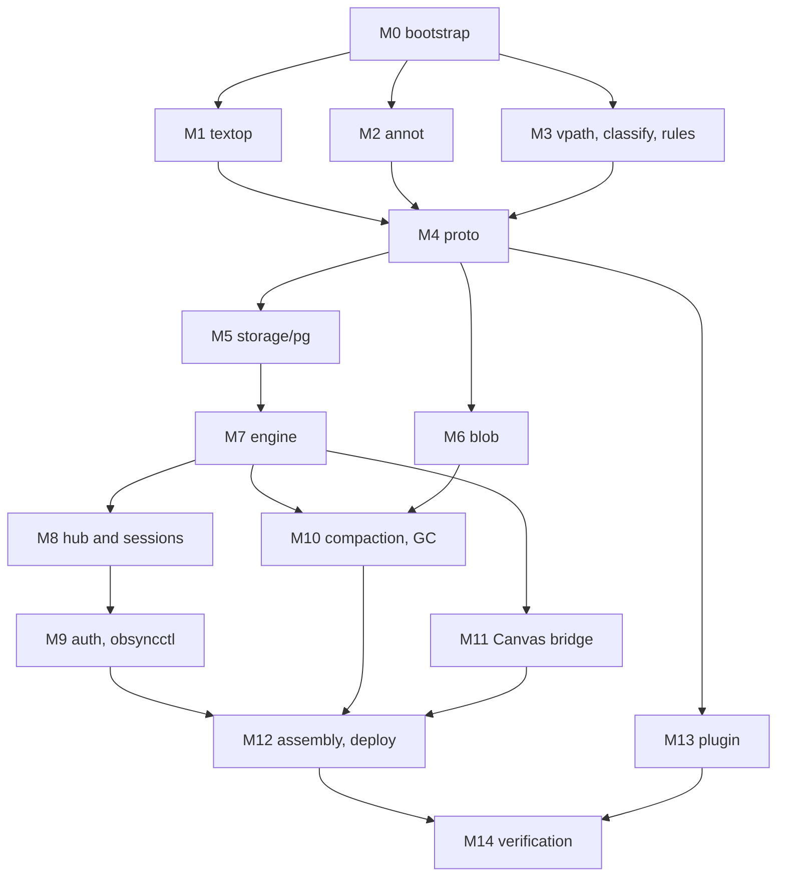

# obsync-single: Implementation Guide

2026-09-20 · @Someone

Build obsync-single as fifteen milestones, pure core first and wiring last, where each milestone ends with tests that prove it works before anything depends on it.

## Build order

Milestones are ordered so that everything a component depends on is already proven when you start it. Pure packages come first because they hold every decision and need no infrastructure; the server exists as a runnable binary only at M12.



The plugin (M13) depends only on the protocol and the shared fixtures, so it can be built in parallel from M4 onward against a fake server. M1 to M3 are independent of each other.

| Milestone | Scope | Human or AI | Rough effort (part-time weeks) |
| --- | --- | --- | --- |
| M0 | Repo, CI, tooling, dev environment | Human, AI drafts YAML | 1 |
| M1 | `core/textop` | Human | 2 |
| M2 | `core/annot` | Human | 1 |
| M3 | `core/vpath`, `classify`, `rules` | Human | 1 |
| M4 | `proto` | Human | 1 |
| M5 | `storage/pg` | Human | 2 |
| M6 | `blob` | Human | 1 |
| M7 | `engine` plus simulation harness | Human | 3 |
| M8 | `session`, hub | Human | 2 |
| M9 | `auth`, `obsyncctl` | Human | 1 |
| M10 | `compact`, `gc` | Human | 1 |
| M11 | `canvasbridge` | Human | 1 |
| M12 | `cmd/obsync-server`, deployment | Human, AI drafts manifests | 1 |
| M13 | Plugin | AI-assisted, human-reviewed | 4 (parallel) |
| M14 | Verification, drills, release | Human | 2 |

That is about 20 part-time weeks on the critical path, consistent with the earlier two-to-four-month estimate for a hardened phase 2 plus the character-level sync added since. Treat it as a planning number, not a commitment.

### How each milestone is written

Every milestone below has the same five parts, and the PR that closes it quotes the last one:

1. **Goal**: what exists afterwards.
2. **Interface**: the Go (or TypeScript) surface other packages may use. Anything not listed stays unexported.
3. **Design notes**: the parts that are easy to get wrong.
4. **Proof**: the tests, by name, that demonstrate it works. Write them first where marked.
5. **Exit criteria**: observable conditions, checked before the next dependent milestone starts.

## M0: Repository bootstrap

**Goal.** One monorepo where `make ci` runs every gate from the guidelines doc on an empty skeleton, and a developer can bring up Postgres and Garage locally with one command.

**Steps.**

1. Create the repo under the final project name if decided; otherwise under a placeholder and plan one rename before the plugin id is published.
2. Import phase 1 with history: `git subtree add --prefix=legacy/obsync-man <phase1-url> main`, then move `cmd/obsync-worker`, `internal/*` and `plugin/` into the new layout in a separate commit so the move is reviewable. Keep phase 1's CI green throughout.
3. Promote `internal/portable` to `internal/core/vpath` and `internal/policy` to `internal/core/policy`, fixing imports. Phase 1 tests must still pass unchanged; that is the proof the move was mechanical.
4. Add `.golangci.yml` with the linters and `depguard` rules from the guidelines. Add an empty package in each layer with a doc comment, and a deliberately forbidden import in a throwaway branch to confirm `depguard` fails it.
5. `compose.yaml` for local dev: Postgres 17 and a single-node Garage (reuse `scripts/garage-dev.sh`).
6. `Makefile` targets: `lint`, `test`, `test-integration`, `fuzz-short`, `sim`, `fixtures`, `contract`, `ci`. Every recipe stays one plain command, as in phase 1, so it runs on Windows without `make`.
7. CI workflows per the gates table. `docs/adr/000-template.md`, ADRs 001 to 012 copied from the architecture decision log as `accepted` (001 as `proposed` until you settle the transform question).
8. PR template with the five required sections.

**Proof.**

- `make ci` passes on the skeleton.
- A branch importing `storage/pg` from `core/textop` fails CI with a `depguard` error.
- Phase 1 unit tests pass from their new locations; the phase 1 Garage integration test passes in CI.

**Exit criteria.** Main branch protected with the required checks; `compose up` yields reachable Postgres and Garage; ADR files exist.

## M1: core/textop

**Goal.** A pure package that parses, applies, composes and transforms text operations, and agrees with ot.js on every generated case.

**Interface.**

```go
package textop

// Doc is text as UTF-16 code units, the unit every position refers to.
type Doc struct{ u []uint16 }
func DocFromString(s string) (Doc, error) // error if s is not valid UTF-8
func (d Doc) String() string
func (d Doc) Len() int

// Op is canonical by construction: no zero-length or adjacent same-kind
// components, insert before delete at the same position.
type Op struct{ comps []comp }

func Parse(raw []byte) (Op, error)         // ot.js JSON; rejects non-canonical input
func (o Op) MarshalJSON() ([]byte, error)
func (o Op) BaseLen() int                  // retains + deletes
func (o Op) TargetLen() int                // retains + inserts

func Apply(d Doc, o Op) (Doc, error)       // ErrLengthMismatch, ErrSplitsSurrogate
func Compose(a, b Op) (Op, error)          // a then b; requires a.TargetLen() == b.BaseLen()
func Transform(a, b Op) (ap, bp Op, err error) // concurrent a, b on the same base; a wins insert ties

// Builder is the only way to construct an Op in code; it canonicalizes as it goes.
type Builder struct{ ... }
func (b *Builder) Retain(n int) *Builder
func (b *Builder) Insert(s string) *Builder
func (b *Builder) Delete(n int) *Builder
func (b *Builder) Op() Op
```

**Design notes.**

- **UTF-16 everywhere inside the package.** Convert once at the boundary with `unicode/utf16`. `Apply` must return `ErrSplitsSurrogate` if a retain or delete boundary falls between a high and low surrogate. An emoji is two units; test with them.
- **Lone surrogates in JSON.** Go's JSON decoder silently turns an escaped lone surrogate like `\ud800` into U+FFFD. That keeps the length but changes the content, so a client and the server would diverge. `Parse` must scan insert strings in the raw JSON and reject lone surrogate escapes before decoding. This has its own fuzz target.
- **Transform** walks both ops component by component, exactly like ot.js: insert in `a` goes first on ties; insert in `b` is retained over in `ap`; retain/retain, delete/delete, retain/delete and delete/retain consume `min(len)` from each side. Write it as a loop over two cursors, not recursion. Delete/delete overlap is the case people get wrong; the property test will find it.
- **Compose** is the same two-cursor walk: a delete in `a` passes through; an insert in `b` passes through; otherwise pair them up.
- **No allocation cleverness yet.** `[]uint16` conversion per apply is O(n) and fine for notes under 8 MiB. Optimize only with a benchmark that says so.

**Design the algorithm before coding it (ADR 001, accepted).** The transform is ours, not borrowed. Before writing Go:

1. Write the full case table for `transform` and `compose`: every pair of component kinds (retain, insert, delete) times every length relation (shorter, equal, longer), with the output each case emits.
2. For each case, argue in one or two sentences why convergence (TP1) holds. This goes in the package doc and in ADR 001.
3. Only then implement, one case per branch, with the case table as the test table.

ot.js stays in the repo only as an independent oracle in `tools/oracle`. Agreeing with a separate implementation on millions of random cases is the strongest evidence available that our derivation has no hole.

**The oracle (`tools/oracle`).** A Node script using the `ot` npm package generates, from fixed seeds, random documents (ASCII, CJK, emoji, CRLF, empty) and random pairs of ops, then writes expected results:

```
schema/textop/apply.json      {doc, op, want | error}
schema/textop/compose.json    {a, b, want}
schema/textop/transform.json  {a, b, want_ap, want_bp}
schema/textop/invalid.json    hand-written malformed ops, each with the expected error
```

`make fixtures` regenerates them; CI fails if regeneration produces a diff. Check ot.js's own tie-breaking convention when generating and record it in the fixture header; Go must match it, whichever it is.

**Proof** (write the first three before the implementation).

| Test | Asserts |
| --- | --- |
| `TestPropConvergence` (rapid) | For random doc `d` and concurrent `a`, `b`: `apply(apply(d,a),bp) == apply(apply(d,b),ap)` |
| `TestPropComposeApply` | `apply(d, compose(a,b)) == apply(apply(d,a), b)` |
| `TestPropLengths` | `ap.BaseLen() == b.TargetLen()` and `bp.BaseLen() == a.TargetLen()` for every transform |
| `TestPropCanonical` | Every op produced by `Builder`, `Compose` or `Transform` is canonical and round-trips through `Parse` |
| `TestOracle{Apply,Compose,Transform}` | Byte-equal to every fixture |
| `TestInvalid` | Every entry in `invalid.json` returns its named error |
| `TestSurrogates` | Splitting an emoji by retain, delete or insert position is rejected |
| `FuzzParse` | No panic; accepted input re-marshals to an equivalent op |
| `FuzzApply` | No panic for any (doc, op); error or a doc of length `TargetLen` |
| `BenchmarkApply` | Baseline recorded for a 50 KB and a 5 MB doc |
| TestCaseTable | Every row of the hand-derived case table, as a named subtest |
| BenchmarkTransformGap | One incoming op across 5,000 historical ops: p99 under 50 ms (S16) |
| BenchmarkApplyLarge | Apply on an 8 MiB document under 50 ms (S16); if it fails, this is the benchmark that justifies a rope or piece table |
| TestOracleScale (nightly) | 10,000,000 generated cases against ot.js, including 1 MiB documents and 500-component ops |

**Exit criteria.** One million rapid cases per property pass locally; fuzz targets run 10 minutes with no finding; oracle fixtures pass; package coverage above 90%.

## M2: core/annot

**Goal.** A pure package that turns a Freedraw sidecar into an id-keyed model, diffs two versions into element operations, applies operations with the conflict rules, and serializes deterministically.

**Before writing code.** Install the pinned Freedraw version, annotate a real PDF (pen, highlighter, eraser, text, inserted page, image) and commit the resulting sidecars to `schema/annot/samples/`. Write down in the package doc: the sidecar file name pattern, where elements live, which field is the element id, and which top-level fields exist. If elements have no stable id, stop and raise it; the whole Class B design assumes one.

**Interface.**

```go
package annot

type ElementID string

type Sidecar struct {
    elements   map[ElementID]element     // raw JSON value + first-created version
    tombstones map[ElementID]Version
    meta       map[string]json.RawMessage // every other top-level field, preserved
}

type Ops struct {
    Elements []ElementOp            // Put{ID, Value} or Del{ID}
    Meta     map[string]json.RawMessage
}

func Parse(b []byte, s Schema) (Sidecar, error)
func Diff(old, new Sidecar) Ops
func Apply(sc Sidecar, ops Ops, at Version) (Sidecar, error)
func Marshal(sc Sidecar, s Schema) ([]byte, error) // deterministic
func CanonicalHash(sc Sidecar) [32]byte            // what the convergence audit compares
```

`Schema` holds the few facts from the samples (elements path, id field) so a Freedraw format change is a config change plus fixtures, not a rewrite.

**Design notes.**

- Element values are kept as `json.RawMessage`, never decoded into Go structs. The server must not need to understand a stroke to sync it, and must not drop fields it does not know.
- Deterministic output: elements ordered by first-created version then id; object keys inside `meta` sorted. Two servers given the same ops produce byte-identical files.
- Rules from the architecture doc: put replaces the whole element; a put to a tombstoned id is dropped and reported (the engine counts it); meta puts are last-writer-wins per top-level key.
- Tombstones are pruned with op retention, not before, or a late put could resurrect an erased stroke.

**Proof.**

| Test | Asserts |
| --- | --- |
| `TestPropDiffApply` | For random sidecars `a`, `b`: `CanonicalHash(Apply(a, Diff(a,b))) == CanonicalHash(b)` |
| `TestPropCommutesOnDisjointIDs` | Ops touching disjoint ids give the same result in either order |
| `TestDeleteWins` | Put after delete of the same id is dropped |
| `TestSamplesRoundTrip` | Every committed Freedraw sample: `Marshal(Parse(x))` parses to the same model, and Freedraw opens the output (manual check, recorded once in the PR) |
| `TestUnknownFieldsPreserved` | Extra fields at every level survive a round trip |
| `TestMarshalDeterministic` | Same model, 100 map iteration orders, one byte sequence |
| `FuzzParse` | No panic on arbitrary bytes; size limit enforced |

**Exit criteria.** Properties pass at 100,000 cases; real samples round-trip and still open in Freedraw; ADR 013 records the verified Freedraw 0.13.3 behaviour (no hot reload of a changed sidecar during annotation; conflict detection plus a recovery copy on save) and the client deferral rules it forces. Re-run the manual check whenever the pinned Freedraw version changes.

## M3: core/vpath, core/classify, core/rules

**Goal.** Three small pure packages that hold every remaining decision: what a legal path is, which class a file belongs to, and how namespace conflicts, windows and conflict copies resolve.

### vpath

Starts as phase 1's `portable`, already tested. Add:

```go
type Path struct{ s string }            // portable, NFC, forward slashes, relative
func Parse(s string) (Path, error)       // strict: rejects instead of sanitizing
func Sanitize(s string) (Path, string)   // phase 1 behaviour, for Canvas names only
func (p Path) Key() string               // casefold(NFC(p)), the uniqueness key
func (p Path) Ext() string
```

Device paths go through `Parse` and are rejected if not portable: silently renaming a user's file is worse than telling them. Canvas names go through `Sanitize`, as in phase 1. Only the server computes `Key`; clients learn about collisions from `path_taken`, so the Go and JavaScript case-folding rules never have to agree.

### classify

```go
type Class byte // 'A', 'B', 'C'
func Classify(p vpath.Path, size int64, head []byte, cfg Config) Class
```

`head` is the first 8 KiB, enough to reject NUL bytes and invalid UTF-8 early; the full check happens when content is parsed. The same rules and extension list live in `schema/classify.json`, checked by the plugin.

### rules

Every namespace and reconnect decision as a pure function over plain values:

```go
func DecideDelete(head, base Version) Decision                // Apply | StaleDelete
func DecideRename(live bool, targetFree bool) Decision
func InWindow(gapOps int, gapAge time.Duration, w Window) bool
func ConflictName(p vpath.Path, device string, at time.Time, taken func(key string) bool) vpath.Path

type DeleteGuard struct{ ... }                                // sliding window per device
func (g *DeleteGuard) Allow(now time.Time, liveFiles int, confirmed bool) bool
```

`time.Time` is passed in, never read. `ConflictName` loops `(conflict ...)`, `(conflict ... 2)` until `taken` says free, with a hard cap, so it can never spin.

**Proof.**

| Test | Asserts |
| --- | --- |
| Phase 1 `portable` suite | Still green after the move |
| `TestKeyCollisions` | `A.md`/`a.md`, NFC/NFD pairs, `ß`/`SS` map as documented |
| `TestClassifyFixtures` | Every row of `schema/classify.json`, in Go and TypeScript |
| `TestDecisionTables` | One table-driven test per function covering every row of the architecture doc's section 4.4 table |
| `TestPropConflictNameUnique` | For random taken-sets, the result is never taken and is always a valid `Path` |
| `TestDeleteGuard` | 25 deletes allowed, 26th refused, confirmed allowed, window slides |
| `FuzzParsePath` | No panic; accepted paths are idempotent under `Parse(p.String())` |

**Exit criteria.** All decision tables in the architecture doc have a matching test row; classify fixtures pass in both languages.

## M4: proto

**Goal.** Typed messages for every frame in the architecture doc's catalogue, a decoder that turns untrusted bytes into validated values or a precise error, and golden frames both languages agree on.

**Interface.**

```go
package proto

type Msg interface{ msgType() string }   // sealed: only this package implements it

type Hello struct { Token string; DeviceID uuid.UUID; Proto int; LastSeq int64 }
type Submit struct {
    ClientOpID uuid.UUID
    FileID     uuid.UUID
    BaseVersion int64
    Body       SubmitBody                    // sealed: TextEdit, AnnotEdit, PutBlob, Create, Rename, RenameGroup, Delete
    Confirmed  bool
}
// ... one struct per catalogue entry

type Limits struct { MaxFrame, MaxInsert, MaxOpsPerEdit, MaxPath int }

func Decode(frame []byte, l Limits) (Msg, error) // *DecodeError carries the reject code
func Encode(m Msg) ([]byte, error)

type Code string                                  // reject codes, the full closed set
const ( InvalidOp Code = "invalid_op"; StaleDelete Code = "stale_delete"; /* ... */ )
```

**Design notes.**

- **Two-pass decode.** Check `len(frame) <= MaxFrame` first, then read only `t`, then decode into that type's struct. Unknown `t` is an error; unknown fields inside a known type are ignored.
- **Parse, don't validate.** `Decode` calls `textop.Parse`, `annot` op parsing and `vpath.Parse`, so a decoded `Submit` carries a canonical `textop.Op` and a legal `vpath.Path`. Nothing downstream re-checks.
- **Payload-only.** `proto` checks shape and limits, not state. Whether `base_version` is stale is the engine's decision.
- **Numbers.** Versions and sequence numbers are `int64` in Go and fit safely in JavaScript numbers below 2^53; the decoder rejects anything larger rather than letting JavaScript round it.
- Protocol version constants and the reject-code list are exported to `schema/protocol/codes.json` so the plugin imports the same set.

**Fixtures.** `schema/protocol/valid/*.json` holds one or more frames per message type; `schema/protocol/invalid/*.json` holds malformed frames, each with the expected code. The plugin's decoder must accept and reject exactly the same files.

**Proof.**

| Test | Asserts |
| --- | --- |
| `TestPropRoundTrip` (rapid generators per type) | `Decode(Encode(m)) == m` |
| `TestGoldenValid` / `TestGoldenInvalid` | Every fixture, both languages |
| `TestLimits` | Oversize frame, insert, op count and path each rejected with `too_large` before any allocation proportional to input |
| `TestExhaustive` | A reflection check that every catalogue type has an encoder, a decoder case and at least one valid fixture |
| `FuzzDecode` | No panic; allocation stays bounded (checked with `testing.AllocsPerRun` on large inputs) |

**Exit criteria.** Fuzzing 10 minutes clean; golden fixtures green in Go; the TypeScript side of the fixtures exists as failing tests the plugin work (M13) must turn green.

## M5: storage/pg

**Goal.** The schema from the architecture doc as goose migrations, and a Postgres implementation of the engine's storage port that makes the write path atomic, ordered and idempotent.

**Interface (declared in `engine`, implemented here).**

```go
// in package engine
type Store interface {
    // InTx locks the given files (ascending id order), runs fn, and commits.
    // fn must not do network I/O. Retries 40001/40P01 a bounded number of times.
    InTx(ctx context.Context, files []FileID, fn func(Tx) error) error
    ChangesAfter(ctx context.Context, seq Seq, limit int) ([]Change, error)
    HeadSeq(ctx context.Context) (Seq, error)
}

type Tx interface {
    Submission(dev DeviceID, id ClientOpID) (*Outcome, error) // idempotency lookup
    Head(f FileID) (Head, error)                              // row already locked
    OpsSince(f FileID, v Version, max int) ([]StoredOp, error)
    PutOp(StoredOp) error
    PutHead(Head) error
    PathTaken(key string) (bool, error)
    AppendChange(Change) (Seq, error)   // bumps vault.head_seq, inserts changes row, pg_notify
    RecordSubmission(dev DeviceID, id ClientOpID, o Outcome) error
}
```

**Design notes.**

- `InTx` locks file rows with `SELECT ... FROM files WHERE id = ANY($1) ORDER BY id FOR UPDATE`. For a create, it locks nothing yet; the unique indexes on `files.id` and `path_key` are the guard, and a unique violation maps to `path_taken`.
- `AppendChange` is always the last statement before commit, so the `vault` row lock is held as briefly as possible and always taken after file rows.
- `pg_notify` inside the transaction is delivered only if it commits. The hub (M8) uses it as a wake-up, never as the data; the data is always re-read from `changes`.
- Queries through `sqlc`; each query file names the milestone and the use. Hot-path `EXPLAIN` outputs go in the PR.
- Migrations embedded with `embed.FS` and run by `obsyncctl migrate`; the server checks `goose` version on start and refuses to run against an unexpected one.

**Proof** (all against a real Postgres via testcontainers-go, `-race` on).

| Test | Asserts |
| --- | --- |
| `TestSeqOrderEqualsCommitOrder` | 16 goroutines commit changes to different files for 30 s while a reader tails `ChangesAfter`; the reader never sees seq `n+1` before seq `n`, and the final sequence is gap-free |
| `TestRollbackLeavesNoGap` | A transaction that calls `AppendChange` then fails leaves `head_seq` unchanged |
| `TestSubmissionIdempotent` | Recording then looking up the same `(device, client_op_id)` returns the stored outcome; a second record violates the key |
| `TestPathKeyUnique` | Two live files with the same key fail; a tombstoned one does not block reuse |
| `TestNoDeadlockUnderGroups` | Concurrent `rename_group`s and single edits over overlapping files for 30 s: zero deadlock errors surface to callers |
| `TestNotifyOnlyOnCommit` | A listener receives the notification for a committed tx and nothing for a rolled-back one |
| `TestMigrationsUpFromEmpty` and `TestSchemaVersionCheck` | Fresh database migrates; mismatched version refuses start |
| `TestConstraints` | Each `CHECK` and foreign key rejects a hand-crafted bad row |

**Exit criteria.** Integration suite green in CI; ordering test run for 10 minutes locally with zero violations.

## M6: blob service

**Goal.** Content-addressed upload and ranged download of Class C bytes through the server, where a blob that does not hash to its name can never become visible.

**Interface.**

```go
package blob

type Service struct{ /* objects.Store (phase 1 interface), Registry, limits */ }

// Put streams r to a temporary key while hashing, verifies sha and size,
// then writes blobs/sha256/..., then records it in Postgres. Idempotent.
func (s *Service) Put(ctx context.Context, sha [32]byte, size int64, r io.Reader) error
func (s *Service) Open(ctx context.Context, sha [32]byte, off, n int64) (io.ReadCloser, error)
func (s *Service) Committed(ctx context.Context, sha [32]byte) (bool, error)

// httpapi wraps it: PUT /v1/blobs/{sha256}, GET with Range.
```

**Design notes.**

- **Verify before publish.** Garage has no atomic rename, so upload to `tmp/<uuid>`, hashing with `io.TeeReader`. On a match, copy to the final key (or re-upload from a spooled temp file if server-side copy is unreliable on your Garage version), then insert the `blobs` row, then delete `tmp/`. A mismatch deletes `tmp/` and returns 422. GC deletes `tmp/` objects older than a day.
- **Existing blob.** If `blobs` already has the hash, drain nothing: return 204 immediately and let the client stop sending (check before reading the body).
- **Limits.** `http.MaxBytesReader` at the configured maximum; `Content-Length` required and must equal the declared size.
- **Download integrity.** Full-object reads re-hash on the way out and abort the response on mismatch, incrementing a corruption metric. Range reads cannot be verified per request, so the plugin verifies the whole file after assembling chunks.
- Reuse phase 1's `RangeReader` capability and its Garage integration test harness rather than writing a new S3 client.

**Proof.**

| Test | Asserts |
| --- | --- |
| `TestPutHashMismatch` | Wrong bytes: 422, no final object, no `blobs` row |
| `TestPutShortAndLong` | Body shorter or longer than declared: rejected, nothing published |
| `TestPutIdempotent` | Same blob twice, and concurrently from two goroutines: one object, one row, both calls succeed |
| `TestPutExistingSkipsBody` | Second upload returns before the body is read |
| `TestCrashPoints` | Injected failure after each step leaves only `tmp/` garbage or a complete blob |
| `TestRange` | 206 with correct bytes for first, middle, last and suffix ranges; 416 for invalid |
| `TestCorruptionDetected` | Object altered behind the service: full read aborts and metric increments |
| Garage integration | The above run against real Garage in CI |

**Exit criteria.** Upload and ranged download of a 512 MiB file work against local Garage with server RSS staying under 64 MiB of additional memory (streaming, never buffering).

## M7: engine and simulation harness

**Goal.** The authority: given a decoded submission, decide, transform, validate and commit it exactly once, one file at a time. Plus a Go reference client and a deterministic simulator that proves convergence and durability before any socket exists.

**Interface.**

```go
package engine

type Engine struct{ /* Store, Snapshots, Clock, Config, actor registry */ }

func New(cfg Config, st Store, snaps Snapshots, clk Clock, m *obs.Metrics) (*Engine, error)
func (e *Engine) Submit(ctx context.Context, dev DeviceID, s proto.Submit) (Outcome, error)
func (e *Engine) Head(ctx context.Context, f FileID) (Head, error)
func (e *Engine) Run(ctx context.Context) error   // owns actor lifecycle; returns on ctx done

type Outcome struct {
    Committed bool
    Seq       Seq        // when committed; the hub delivers the ack
    Version   Version
    Reject    proto.Code // when not committed
}
```

**Design notes.**

- **Document actors.** `Submit` routes to the actor for the file (created on demand, evicted after 5 minutes idle). An actor is one goroutine with a bounded mailbox (64). A full mailbox returns `rate_limited` immediately. Namespace operations spanning several files (`rename_group`) go through a single namespace actor, which takes the file locks in the database in id order; this avoids actor-to-actor coordination.
- **Pipeline inside the actor**, in this order: idempotency lookup, load head (cache or `Tx.Head`), decide with `core/rules`, fetch ops since base (reject `rebase_required` if outside the window or pruned), transform with `core/textop` or apply with `core/annot`, validate the result against size limits, then write op, head, change and submission record in one `InTx`. The in-memory head is updated only after commit returns success.
- **Ambiguous commit.** If `COMMIT` returns a network error, the actor does not know the outcome. It drops its cached head, returns `internal`, and the client's retry resolves it through the idempotency record. Never guess.
- **Rejects are not recorded.** A reject has no effect, so re-evaluating a retried submission is safe; at most one effect is still guaranteed.
- **The engine never talks to sockets.** Acks and broadcasts come from the hub reading the committed feed (ADR 012). `Outcome` is for metrics, tests and immediate rejects.
- **Conflict copies** are ordinary `create` changes authored by the system in the same transaction as the decision that triggered them, followed by a `notice`.

### The reference client (`internal/client`)

A Go implementation of the client side: the per-file three-state machine (`Synchronized`, `AwaitingAck`, `AwaitingAckWithBuffer`), shadow handling, and cursor persistence. It is small, human-written, and used three ways: by the simulator, by `tools/loadgen`, and as the behavioural reference for the TypeScript plugin. Its scenarios are exported to `schema/client/scenarios.json` (a sequence of local edits and server messages, and the expected outgoing messages and document) so the plugin's sync core is checked against the same traces.

### The simulator (`tools/sim`)

- In-memory `Store` fake with the same semantics as Postgres for this port (serial transactions, gap-free seq, idempotency), a virtual clock, and a fake hub reading the fake feed.
- N reference clients, a seeded random scheduler that interleaves: local edits, message delivery with arbitrary delay (per-session order preserved, as TCP does), disconnects, reconnects, client crashes that lose in-memory state but keep persisted shadow and cursor, and server crashes that lose everything but the store.
- After each run: quiesce, then assert every client document equals the server head, every acked op is in the log exactly once, and no client ever observed a seq gap.

**Proof.**

| Test | Asserts |
| --- | --- |
| `TestPipelineTable` | Each architecture-doc rule (stale delete, deleted file, path taken, window) produces its code |
| `TestIdempotentRetry` | Same submission twice: one op, same `Outcome` |
| `TestAmbiguousCommit` | Injected commit error: cache dropped, retry yields exactly one application |
| `TestMailboxFull` | 65th queued submission rejected, earlier ones unaffected |
| `TestActorEviction` | Idle actor stops; next submit recreates it with correct state; no goroutine leak (`goleak`) |
| `TestClientScenarios` | Reference client matches every scenario trace |
| `TestSim` (CI: 500 seeds; nightly: 10,000) | Convergence, exactly-once, gap-free, for 3 to 5 clients |
| `TestSimFindsPlantedBug` | With a deliberately broken transform, the simulator fails within 100 seeds. A harness that cannot catch a planted bug proves nothing. |

**Exit criteria.** 10,000 simulator seeds pass; the planted-bug test fails the harness as expected; any failing seed ever found is committed as a regression case.

## M8: hub and sessions

**Goal.** Devices connect over WebSocket, authenticate, catch up, submit, and receive every change in gap-free sequence order, while a slow or hostile connection can never hurt another.

**Interface.**

```go
package session

type Hub struct{ /* Store (ChangesAfter, HeadSeq), ring, sessions */ }
func NewHub(st engine.Store, listener Notifier, cfg HubConfig, m *obs.Metrics) *Hub
func (h *Hub) Run(ctx context.Context) error                  // single goroutine
func (h *Hub) Join(s *Session, after Seq) (live bool)          // false: keep pulling

type Server struct{ /* Hub, Engine, Authenticator, limits */ }
func (s *Server) ServeHTTP(w http.ResponseWriter, r *http.Request) // /v1/ws
```

**Design notes.**

- **Library:** `github.com/coder/websocket`. `Accept` with `OriginPatterns` from config, subprotocol `obsync.v1`, `SetReadLimit(MaxFrame)`, compression off (simpler, and avoids compression side-channel concerns).
- **Per session, exactly two goroutines**: a reader (decode, rate-limit, dispatch to engine) and a writer (drains a bounded outbound queue, sends pings). The reader never writes to the socket; it enqueues. When either exits, the session's context is cancelled and the other exits too.
- **Handshake:** a 5 s deadline for `hello`; nothing else is decoded before it. Auth failure closes 4401. A second session for the same device closes the first with 4409.
- **Hub loop.** One goroutine. It wakes on `LISTEN obsync_changes` (a dedicated connection) or a 1 s fallback tick, calls `ChangesAfter(published, 500)` in a loop, appends to a ring of the last 10,000 changes, and for each change enqueues `ack` to the originating device's session and `remote` to all others. `NOTIFY` is only a doorbell, so a missed notification costs at most one tick of latency, never a lost change.
- **Catch-up then live.** A new session answers `pull_changes` from the database itself (not the hub goroutine, so a big catch-up never stalls fan-out). When its cursor is within the ring, it calls `Join`; the hub atomically enqueues ring entries after the cursor and marks the session live. If the cursor fell out of the ring in the meantime, `Join` returns false and the session pulls again.
- **Backpressure.** Enqueue is non-blocking. A full queue (1,024 frames or 8 MiB) closes the session with 4429 and increments `obsync_slow_consumer_closes_total`. The hub never waits on a session.
- **Inbound limits:** token bucket per device (50/s, burst 200); in-flight counts per file and per device checked before calling the engine.
- **Heartbeat:** ping every 20 s; no pong in 10 s cancels the session.
- **Panics** in a session goroutine are recovered, logged with the event `session.panic`, and close only that session with 1011.

**Proof.** Timing tests run inside `testing/synctest` over in-memory connections (`net.Pipe` wrapped as a WebSocket), because real network sockets do not count as durably blocked inside a synctest bubble. Ordering and race tests use real sockets on loopback.

| Test | Asserts |
| --- | --- |
| `TestHelloDeadline` | No hello in 5 s: closed 4401, engine never called |
| `TestBadOrigin` / `TestBadToken` | Rejected before any other frame is processed |
| `TestTakeover` | Second connection for a device closes the first with 4409 |
| `TestOrderAcrossFiles` | Two devices hammer different files; every session receives strictly increasing, gap-free seq |
| `TestAckOrdering` | A device's ack for seq n never arrives before a remote with seq below n |
| `TestJoinRace` | Commits keep arriving while a session catches up and joins; no gap, no duplicate |
| `TestSlowConsumer` | A client that stops reading is closed 4429; a second client's latency is unaffected |
| `TestHeartbeat` | Silent peer closed after 30 s of virtual time |
| `TestMissedNotify` | Notifications suppressed: changes still delivered within the fallback tick |
| `TestRateLimit` | Flood gets `rate_limited`; the session survives if it slows down |
| `TestNoGoroutineLeak` | 1,000 connect/disconnect cycles, `goleak` clean |
| Autobahn subset (optional) | The library already passes it; run once to confirm your configuration |

**Exit criteria.** The reference client from M7 syncs through real sockets against a real Postgres, and the simulator's invariants hold in an end-to-end test with 5 socket clients for 10 minutes.

## M9: auth and obsyncctl

**Goal.** Devices are enrolled with a one-time code and revoked instantly, and every administrative action is a CLI command that talks to Postgres directly, so operating the system never requires editing rows by hand.

**Interface.**

```go
package auth

func NewEnrollmentCode(ctx context.Context, st Store, name string, ttl time.Duration) (code string, err error)
func Enroll(ctx context.Context, st Store, code string) (DeviceID, Token, error) // single use
func (a *Authenticator) Verify(ctx context.Context, tok Token) (DeviceID, error)  // constant-time
func Revoke(ctx context.Context, st Store, id DeviceID) error                     // + pg_notify
```

```
obsyncctl migrate
obsyncctl device add <name> | list | revoke <name|id>
obsyncctl file history <path> | show <path> --version N | restore <path> --version N
obsyncctl file undelete <path>
obsyncctl feed tail                     # live view of the change feed, for debugging
obsyncctl check                         # recompute every head hash from snapshot + ops; report mismatches
```

**Design notes.**

- Codes: 8 characters from an unambiguous alphabet (no 0/O, 1/l), stored hashed, 10 minute TTL, deleted on use. `/v1/enroll` is rate-limited per source address, since it is the only unauthenticated write endpoint.
- Tokens: 32 bytes from `crypto/rand`, base64url, prefixed `obs_` so a leaked one is greppable in logs and secret scanners. Stored as SHA-256; compared with `subtle.ConstantTimeCompare` after lookup by hash.
- Revocation publishes a notification; the hub closes that device's session within one second.
- `file restore` does not rewrite history. It submits a new edit (through the engine, as the system device) that makes the head equal the old version, so devices receive it as a normal change.
- `check` is the offline version of the convergence audit and doubles as a corruption detector for snapshots.

**Proof.**

| Test | Asserts |
| --- | --- |
| `TestCodeSingleUse` / `TestCodeExpiry` | Second use and expired use both fail |
| `TestRevokeClosesSession` | Live session closed with 4401 within 1 s of revoke |
| `TestTokenNotLogged` | Full enroll and session with a canary token; the token string appears in no log line |
| `TestRestoreIsAnEdit` | Restore produces a new version whose content equals the old one; other devices receive it |
| `TestCheckDetectsCorruption` | A tampered snapshot is reported |
| CLI golden tests | Each command's output on a seeded database matches a golden file |

**Exit criteria.** A device can be enrolled, used, revoked and re-enrolled using only `obsyncctl` and the plugin; a deleted file can be restored.

## M10: compaction and GC

**Goal.** History stays reconstructible and bounded: every file reaches a snapshot soon after it goes idle, old ops and changes are pruned only when nothing needs them, and unreferenced objects are collected without ever deleting something in use.

**Interface.**

```go
package compact

// Pure trigger decision, lives in core/rules or here with no I/O.
func Due(s FileStats, now time.Time, t Triggers) bool

type Compactor struct{ /* Store, objects.Store, Clock, Triggers */ }
func (c *Compactor) Run(ctx context.Context) error        // scans candidates, bounded concurrency (2)
func (c *Compactor) CompactOne(ctx context.Context, f FileID) error
func (c *Compactor) Prune(ctx context.Context, now time.Time) error

package gc
func Collect(ctx context.Context, st Store, objs objects.Store, now time.Time, dryRun bool) (Report, error)
```

**Design notes.**

- **CompactOne order:** read head and version in a short read transaction; serialize (text as UTF-8, sidecar with `annot.Marshal`); `PUT snapshots/<file_id>/<version>` (write-once, retry-safe); insert the `snapshots` row. No lock is held across the upload; if the head moved meanwhile, the snapshot is still valid for its own version.
- **Prune** deletes ops with `created_at` older than retention **only** when a snapshot exists at a version at or above them, and deletes `changes` rows older than retention. Clients whose cursor predates the oldest retained change get `resync_required`.
- **Candidates** come from a query over files with ops since their last snapshot, ordered by uncompacted bytes, so the worst file is always handled first.
- **GC** reuses phase 1's mark-and-sweep shape: take its own advisory lock; mark from live heads, tombstones within retention, and snapshots within retention; list `blobs/`, `snapshots/` and `tmp/`; delete unmarked objects older than 24 hours; report counts. `-dry-run` is the default in the CLI; `-apply` must be explicit.
- Compaction runs inside the server (it needs little and benefits from the hot cache); GC is a separate CronJob, as in phase 1.

**Proof.**

| Test | Asserts |
| --- | --- |
| `TestDueTable` | Each trigger fires at its threshold and not below |
| `TestSnapshotPlusOpsEqualsHead` (rapid) | For random edit histories: latest snapshot plus remaining ops reproduces the head exactly |
| `TestReconstructAnyVersion` | Every version inside retention is reconstructible and matches what was recorded when it was head |
| `TestCrashBetweenPutAndRow` | Object without row is harmless and later collected |
| `TestPruneNeverOrphans` | No op is deleted unless a later-or-equal snapshot exists |
| `TestGCKeepsReferenced` | Live, tombstoned-in-retention and snapshot-referenced blobs survive; unreferenced old ones go; young unreferenced ones stay |
| `TestGCConcurrentUpload` | An upload in progress (in `tmp/`, younger than 24 h) is never collected |
| Garage integration | Compaction and GC against real Garage |

**Exit criteria.** In the simulator with compaction enabled, all M7 invariants still hold; `obsyncctl check` reports zero mismatches after a 24 h local soak.

## M11: Canvas bridge

**Goal.** Phase 1's output appears in every vault under `Canvas/`, updates within one worker cycle, and a Canvas-side change never damages anything the user created.

**Interface.**

```go
package canvasbridge

// Pure: phase-1 manifest entries in, namespace + blob submissions out.
func Plan(prev, cur manifest.Manifest, course CourseInfo, live LiveIndex) []Action

type Bridge struct{ /* phase-1 objects.Store (bucket obsync), blob.Service, Engine, Clock */ }
func (b *Bridge) Run(ctx context.Context) error   // poll every 5 min; one course at a time
```

**Design notes.**

- **Read-only against phase 1.** The bridge holds a read-only key on bucket `obsync`. It reads `manifests/<course>/latest` and the referenced manifest, using phase 1's `manifest` package unchanged, and remembers per course the last imported `run_id` in a small `canvas_imports` table.
- **Blob transfer by hash.** A phase 1 blob is already SHA-256 addressed. Copy it into `obsync-sync` through `blob.Service.Put` (which re-verifies the hash) only if not already present.
- **Mapping** (phase 1 entry state to action): `stored` new path: create; `stored` changed hash: put blob, notice `canvas.changed`; path gone or `deleted`: delete the PDF only, notice `canvas.removed`; `skipped`, `locked`, `failed`: nothing in the vault, but `locked` can surface a notice `canvas.upcoming` if you want it later.
- **Resurrection** (phase 1's re-upload case, new Canvas id, same path): treated as a change, not delete plus create, so sidecars stay paired.
- **Ownership:** all bridge submissions use the `canvas` system device and `owner = 'canvas'`. The engine rejects device writes to canvas-owned Class C files with `read_only_path`. A user renaming a Canvas file is also refused; the path is the lecturer's.
- **Failure isolation:** one course failing does not stop the others (the phase 1 rule), and a bridge failure never affects sync. The bridge is a client of the engine, not part of it.

**Proof.**

| Test | Asserts |
| --- | --- |
| `TestPlanTable` | Each manifest state transition maps to the documented action |
| `TestResurrectionKeepsSidecar` | Delete-and-reupload with a new id keeps the PDF's file id and its sidecar pairing |
| `TestDeletionSparesUserFiles` | Canvas removes a PDF; its sidecar and notes in the same folder remain, flagged |
| `TestReadOnlyPath` | A device write to a canvas-owned PDF is rejected |
| `TestIdempotentImport` | Running the bridge twice on the same `run_id` produces no new changes |
| Integration | Phase 1 memory store seeded from `schema/manifest-golden.json`; bridge output verified end to end |

**Exit criteria.** A real phase 1 run against one course appears in a test vault through the plugin, and a simulated re-upload shows a Canvas notice.

## M12: server assembly and deployment

**Goal.** `cmd/obsync-server` wires the proven components into one process that starts safely, shuts down cleanly, exposes health and metrics, and runs in the K3s cluster through Argo CD.

**Wiring (`main.go`, nothing else in it).**

```go
func run(ctx context.Context, cfg config.Config) error {
    // 1. logger, metrics registry
    // 2. pg pool; verify schema version; take advisory lock on a dedicated conn (exit if held)
    // 3. objects store (Garage); blob.Service
    // 4. engine.New; hub; session.Server; httpapi handlers
    // 5. compactor; canvas bridge
    // 6. errgroup: engine.Run, hub.Run, compactor.Run, bridge.Run,
    //    public http.Server, internal http.Server (health, metrics, pprof)
    // 7. on ctx done: shutdown sequence from the guidelines, then return
}
```

The advisory-lock connection is watched: if it drops, the process cancels its root context and exits non-zero, because it can no longer prove it is the only authority.

**Two listeners.** Public (`:8443` behind ingress): `/v1/ws`, `/v1/blobs/*`, `/v1/enroll`. Internal (`:9090`, never exposed): `/livez`, `/readyz`, `/metrics`, `/debug/pprof`.

**Deployment files** (`deploy/apps/obsync-server/`, kustomize, bootstrapped into homelab-cicd-config as in phase 1):

| File | Contents |
| --- | --- |
| `deployment.yaml` | `replicas: 1`, `strategy: Recreate`, `terminationGracePeriodSeconds: 30`, probes on the internal port, non-root, read-only root filesystem, resources from the architecture doc |
| `migrate-job.yaml` | Argo CD PreSync hook running `obsyncctl migrate` |
| `cluster.yaml` | CloudNativePG `Cluster`, 1 instance, WAL archive and scheduled base backup to the backup Garage |
| `garage-bucket` notes | Bucket `obsync-sync` and its key created on the existing Garage (documented commands, as in phase 1's deploy README) |
| `ingress.yaml` | Tailnet-only host, TLS |
| `servicemonitor.yaml`, `prometheusrule.yaml` | Scrape config and the alerts listed in the architecture doc |
| `gc-cronjob.yaml` | Daily, `Forbid` |
| `sealedsecret-*.yaml` | Postgres app credentials, Garage keys, TLS |

**Proof.**

| Test | Asserts |
| --- | --- |
| `TestConfigValidation` | Every invalid config reports all errors at once; defaults equal the architecture doc |
| `TestSecondInstanceExits` | Two processes against one database: the second exits with a clear log line |
| `TestLockLossExits` | Killing the lock connection stops writes and exits the process |
| `TestGracefulShutdown` | SIGTERM with 5 connected clients and in-flight submits: every committed submit is acked or recoverable by retry; clients receive 1001; exit within 30 s |
| `TestReadiness` | Not ready before migrations and lock; not ready when Postgres is down; ready while Garage is down |
| e2e smoke in CI | Container image starts against Postgres and Garage containers; reference client syncs one file |
| Render check | `kustomize build` output validated with `kubeconform` |

**Exit criteria.** Deployed to the cluster through Argo CD; two reference clients sync over the tailnet; dashboards show the metrics; a deliberate `kubectl rollout restart` causes no lost edits.

## M13: Obsidian plugin

**Goal.** A plugin that behaves exactly like the Go reference client, integrated into Obsidian's editor and vault without echo loops, data loss or blocking the UI. This is the milestone where AI drafting is allowed; the fixtures written in M1 to M7 are the leash.

**Build order inside the milestone** (each step green before the next):

1. **`core/` passes every shared fixture**: textop, annot, protocol, classify, client scenarios. No Obsidian code yet. The Go fixtures written in M1 to M7 define done.
2. **`transport/`**: WebSocket client (`obsync.v1`), hello-first auth, reconnect with full jitter, heartbeat reply, ordered inbound queue, blob upload and Range download through `requestUrl` with `appendBinary`.
3. **`vault/` shadow store**: IndexedDB; shadow text, `base_version`, pending buffer and `last_seq`, updated transactionally after each applied server message.
4. **`vault/` editor bridge**: a CodeMirror 6 extension registered with `registerEditorExtension`. It converts local transactions to text ops, skips any transaction carrying the plugin's `remote` annotation, and applies remote ops as a single dispatched transaction with that annotation so cursor and selection map correctly.
5. **`vault/` file watcher**: `create`, `modify`, `delete`, `rename` vault events. For a file not open in an editor, a `modify` is diffed against the shadow to produce an op. The plugin's own writes are recognized by comparing the new content's hash with the content it just wrote, so they are never echoed.
6. **First sync**: a newly enrolled device, or one with an unknown vault, runs pull-only: `list_files`, download everything within its policy, then enable uploads. Local files that differ from the server become conflict copies; local-only files are uploaded only after the user confirms in a dialog showing the list.
7. **Freedraw handling**: Freedraw does not reload external sidecar changes while a PDF is open (ADR 013). While a PDF is open in any leaf, apply remote Class B ops to the shadow only, queue the disk write, and flush it when the PDF closes. Diff Freedraw's own saves against the on-disk base, not the newer shadow, so only local strokes are submitted. Test: device A adds strokes while device B is annotating the same PDF; after B closes and reopens it, both sets of strokes are present and no recovery copy was created.
8. **`ui/`**: status bar (connected, syncing N, offline, error), conflicts view listing conflict copies with open and compare actions, Canvas notices view, settings (server URL, enroll code, exclusion rules from phase 1, debug log toggle), bulk-delete confirmation modal.

**Design notes.**

- The editor bridge is the riskiest code in the project and the least testable. Keep it thin: it translates between CodeMirror changes and `core` ops, and nothing else.
- Never write to a file with `Vault.modify` while it is open; use the editor. For background files use `Vault.process` and verify inside the callback that the current content equals the shadow the op was computed against; if not, re-diff first.
- All decisions stay in `core/`, where they are unit-testable. If a bug fix lands in `vault/` or `ui/` and changes a sync decision, it is in the wrong layer.

**Proof.**

| Test | Asserts |
| --- | --- |
| Contract suites | Every fixture in `schema/` passes in Vitest |
| `transport` against the real server | CI starts `obsync-server` with Postgres; a Node harness runs the plugin's `core` and `transport` against it and syncs with the Go reference client |
| Property tests (fast-check) | Client state machine: any interleaving of local edits and server messages converges with a model server |
| Echo test | Applying a remote op produces zero outgoing submissions |
| Crash recovery | Kill the harness mid-edit; on restart the diff against the shadow regenerates exactly the lost pending edit |
| Manual matrix (recorded in the PR) | Desktop and Android: type in both, draw in Freedraw, rename a PDF with its sidecar, go offline 1 h on each, delete a folder, open an empty vault folder, revoke the device |

**Exit criteria.** Two real devices sync text and Freedraw strokes with no manual intervention for a week of normal use; every item of the manual matrix passes on both platforms.

## M14: verification and release

**Goal.** Every success criterion S1 to S15 in the architecture doc has recorded evidence from the deployed system, and v1.0.0 is tagged only when all of them pass.

### Tooling to build first

- **`tools/loadgen`**: N reference clients with a configurable edit mix (typing bursts, pastes, sidecar strokes, renames, blob puts), a target rate, and a report of latency percentiles and invariant checks.
- **`tools/chaos`**: a harness that runs a workload and, at random intervals, sends `SIGKILL` to the server, restarts it, and at the end verifies exactly-once and convergence.
- **Toxiproxy** between clients and server, and between server and Postgres, for latency, bandwidth limits and partitions.
- **Latency probe**: two reference clients on the same host (one clock, no skew). A writes a marker, B timestamps its arrival. Run over the tailnet from the cluster's far side. This is the honest measurement for S5; cross-device timestamps are skewed.

### Criterion to procedure

| Criterion | Procedure | Evidence committed |
| --- | --- | --- |
| S1 OT correctness | M1 properties at 1,000,000 cases; oracle suite | CI log |
| S2 chaos convergence | `tools/sim` 10,000 seeds | Nightly log |
| S3 crash durability | `tools/chaos`, 100 kills over a 50,000-op workload | Report: 0 lost, 0 duplicated |
| S4 real-device soak | 7 days, desktop plus Android plus loadgen at low rate | Dashboard screenshot of `obsync_convergence_mismatch_total` = 0 |
| S5 latency | Latency probe, 10,000 samples | Percentile report |
| S6, S7 offline | Scripted with two reference clients and a virtual 24 h gap, then repeated by hand on devices | Test log plus manual notes |
| S8 namespace | Scripted race suite | Test log |
| S9 guards | Empty-folder device and 100-delete script | Test log plus screenshot of the confirmation |
| S10 abuse | 1 h fuzz per target; flood, oversize, slowloris and slow-reader scripts while another client edits | Fuzz log; memory graph |
| S11 dependency failure | Stop Postgres 10 min, then Garage 10 min, during loadgen | Timeline with alerts fired and recovery |
| S12 restore | Restore CloudNativePG from the backup Garage into a scratch namespace; point a server at it | Drill notes with timings |
| S13 Canvas | Real course cycle, plus a forced re-upload in a test course | Screenshots of notices |
| S14 footprint | Loadgen with 5 clients, 20,000 files, 200 MB text | Memory graph |
| S15 operability | Someone else follows the runbooks cold | Their notes, and the runbook fixes that resulted |

### Release checklist

- [ ] All S1 to S15 evidence present in `docs/verification/`.
- [ ] Open questions in the architecture doc resolved or explicitly deferred with an ADR.
- [ ] Runbooks complete: deploy, rollback, revoke, restore version, restore backup, rotate TLS.
- [ ] Alerts tested by triggering each at least once.
- [ ] Final project name applied; plugin id stable.
- [ ] README states what is proven, how, and what is out of scope, with links to the evidence. That is the portfolio artifact.
- [ ] Tag `v1.0.0`; protocol version 1 frozen.

## Sources

The architecture spec and engineering guidelines carry the full reference lists; these are the ones each milestone leans on directly.

- M1: [ot.js](https://github.com/Operational-Transformation/ot.js) (reference implementation and oracle); [Jupiter paper](https://uist.acm.org/uist1995/abstracts/Nichols.html); [Go `unicode/utf16`](https://pkg.go.dev/unicode/utf16)
- M1 to M4, M7: [rapid](https://github.com/flyingmutant/rapid); [Go Fuzzing](https://go.dev/doc/security/fuzz/)
- M2: [Freedraw PDF](https://community.obsidian.md/plugins/freedraw-pdf)
- M3: phase 1 [`portable` package and DESIGN.md](https://github.com/BarneyLaw/obsync-man-worker/blob/main/DESIGN.md); [golang.org/x/text/cases](https://pkg.go.dev/golang.org/x/text/cases)
- M5: [PostgreSQL NOTIFY](https://www.postgresql.org/docs/current/sql-notify.html) (delivery at commit); [Explicit Locking](https://www.postgresql.org/docs/current/explicit-locking.html); [pgx](https://github.com/jackc/pgx); [sqlc](https://docs.sqlc.dev/); [goose](https://github.com/pressly/goose); [Testcontainers for Go](https://golang.testcontainers.org/)
- M7, M8: [Transactional outbox pattern](https://microservices.io/patterns/data/transactional-outbox.html); [coder/websocket](https://github.com/coder/websocket); [testing/synctest](https://go.dev/blog/synctest); [goleak](https://github.com/uber-go/goleak)
- M8, M9: [OWASP WebSocket Security Cheat Sheet](https://cheatsheetseries.owasp.org/cheatsheets/WebSocket_Security_Cheat_Sheet.html)
- M12: [CloudNativePG backup and recovery](https://cloudnative-pg.io/documentation/current/backup/); [kubeconform](https://github.com/yannh/kubeconform); [Kubernetes probes](https://kubernetes.io/docs/tasks/configure-pod-container/configure-liveness-readiness-startup-probes/)
- M13: [CodeMirror collab example](https://codemirror.net/examples/collab/); [Obsidian plugin guidelines](https://docs.obsidian.md/Plugins/Releasing/Plugin+guidelines); [fast-check](https://fast-check.dev/)
- M14: [Toxiproxy](https://github.com/Shopify/toxiproxy); [Google SRE Workbook: Alerting on SLOs](https://sre.google/workbook/alerting-on-slos/)
